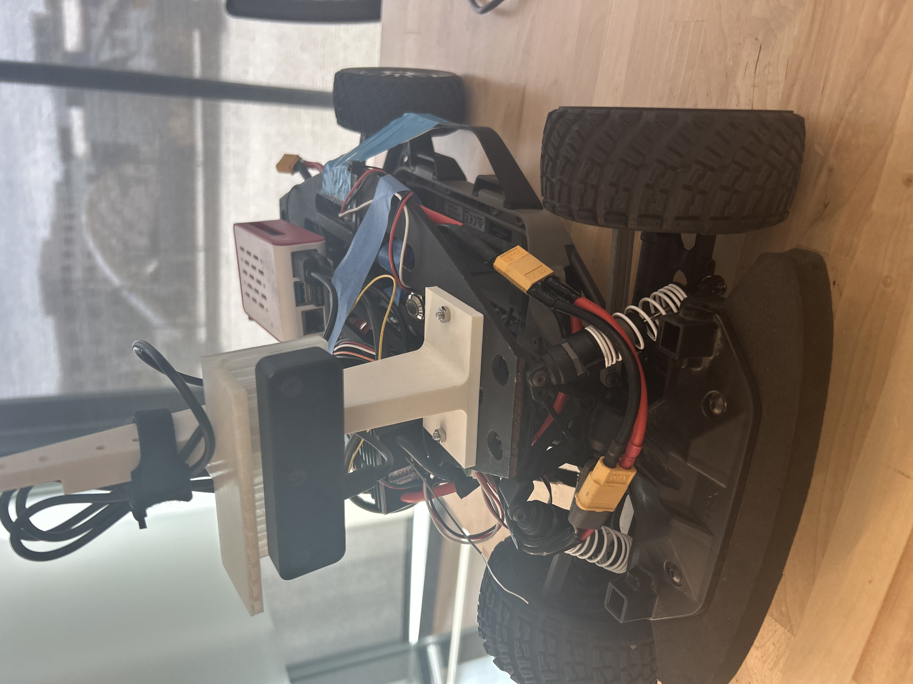

[](https://classroom.github.com/a/r686kJSN)

# UCSD ECEMAE148 Team5 FinalProject
Team 5 Final Project Repository - Hazardous Location Recon


  
</body>


<div id="top"></div>

<h1 align="center">Hazardous Location Reconissance</h1>
<h4 align="center"></h4>
<!-- PROJECT LOGO -->
<br />
<div align="center">

<h3>ECEMAE148 Final Project</h3>
<p>
Team 5 Spring 26
</p>


Current Placeholder From Week 1

</div>


<!-- TABLE OF CONTENTS -->
<details>
  <summary>Table of Contents</summary>
  refer to Jose github 
</details>


<!-- TEAM MEMBERS -->
## Team Members

<div align="center">
    <p align = "center">Josiah, Kim, Kathya, AnMei</p>
</div>

<h4>Team Member Major and Class </h4>
<ul>
  <li>Josiah - MAE</li>
  <li>Kim - MAE</li>
  <li>Kathya -  ECE</li>
  <li>AnMei - ECE</li>
</ul>

<!-- Final Project -->
## Final Project
<!-- put stuff here -->

<!-- Original Goals -->
### Original Goals
The robot drives into a "danger zone" on its own. It uses its camera to "scout" for trouble. When it finds a hazard, it stops, drops a physical marker to show where the danger is, and saves the exact location (GPS) on a map. We planned to navigate within a certain grid, use the OAK-D Camera and a YOLO model to identify the targets and run a standard program upon identification. This program will consist of dropping the marker, finding the second and returning back home. 
<!--example non visible text here -->
   
<!-- End Results -->
### Goals We Met
<p>
  We are currently in the development phase of the initial mechanical prototypes while we catch up on the remaining class content. 

  Final updates will be placed accordingly upon completion. 


### If We Have Another Week...
#### Stretch Goal 1
Identify and locate more targets. 


#### Stretch Goal 2
Fly. 


## Final Project Documentation

<!-- Early Quarter -->
### CAD Design etc etc
<!---->

#### Modeled Ourselves
| Part | CAD Model | Description |
|------|--------| -------------------- |
| Base PLate |  | ----- |
| Camera Mount |  |  ----- |
| Payload Bay |  |  ----- |
| Payload |  | ----- |

#### Open Source Parts
| Part | CAD Model | Source |
|------|--------|-----------|
| Part |  | ------------------- |
| Part |  | [Thingiverse](https://www.thingiverse.com/thing:3532828) |

### Software

#### Embedded Systems
text

#### ROS2
text 


### How to Run
text

```example for_format```


Youtube link (Use for format)
<a href= "link here">Name of Link


<!-- Authors -->
## Authors

Josiah, Kim, Kathya, AnMei


<!-- ACKNOWLEDGMENTS -->
## Acknowledgments

*This class be pretty cool. Fun fact: We're nowhere close to finishing this at the moment.*


<!-- CONTACT -->
## Contact

* Josiah | jhallett@ucsd.edu
* Kim | insert here
* AnMei | insert here
* Kathya | insert here
