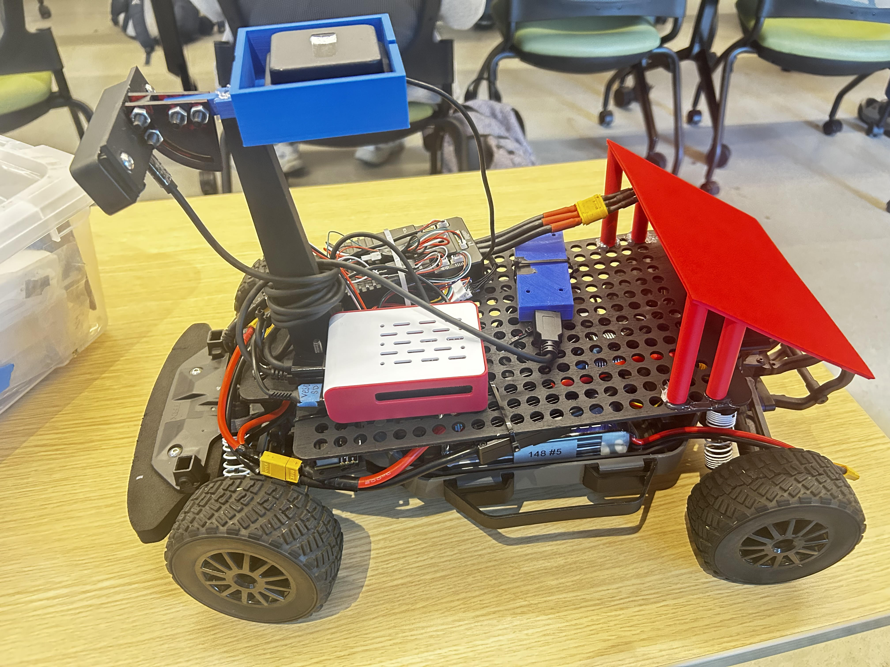

# UCSD ECE/MAE 148 Team 5 - Hazardous Location Reconnissance

<div align="center">

</div>
  
</body>

<div id="top"></div>

<h1 align="center">Hazardous Location Reconissance</h1>
<h4 align="center"></h4>
<!-- PROJECT LOGO -->
<div align="center">


<h3>ECE/MAE148 Final Project</h3>
<p>
Team 5 Spring 26
</p>



</div>


<!-- TABLE OF CONTENTS -->
<details>
  <summary>Table of Contents</summary>
  <ol>
    <li><a href="#team-members">Team Members</a></li>
    <li><a href="#final-project">Final Project</a></li>
      <ul>
        <li><a href="#original-goals">Original Goals</a></li>
          <ul>
            <li><a href="#goals-we-met">Goals We Met</a></li>
            <li><a href="#our-hopes-and-dreams">If We Have Another Week...</a></li>
              <ul>
                <li><a href="#stretch-goal-1">Stretch Goal 1</a></li>
                <li><a href="#stretch-goal-2">Stretch Goal 2</a></li>
              </ul>
         </ul>
       </ul>
    <li><a href="#final-project-documentation">Final Project Documentation</a></li>
    <ul>
      <li><a href="#CAD-Design">CAD Design </a></li>
      <ul>
            <li><a href="#modeled-ourselves">Modeled Ourselves</a></li>
            <li><a href="#open-source-parts">Open Source Parts</a></li>
          </ul>
        <li><a href="#Software">Software</a></li>
          <ul>
            <li><a href="#embedded-systems">Embedded Systems</a></li>
            <li><a href="#ros2">ROS2</a></li>
            <li><a href="#how-to-run">How to Run</a></li>
          </ul>
      </ul>
    <li><a href="#authors">Authors</a></li>
    <li><a href="#acknowledgments">Acknowledgments</a></li>
    <li><a href="#contact">Contact</a></li>
  </ol>
</details>


<!-- TEAM MEMBERS -->
## Team Members

<ul>
  <li>Josiah - Mechanical Engineering - '28</li>
  <li>Kim - MAE</li>
  <li>Kathya -  ECE</li>
  <li>AnMei - ECE</li>
</ul>

<!-- Final Project -->
## Final Project
<!-- put stuff here -->

<!-- Original Goals -->
### Original Goals
Our initial goals consisted of identifying and notifying individuals of a hazardous location through a physical marker. Following along a specified route, there would be four posibble inputs while running: Hazard 1 (Fire), Hazard 2 (Toxic Spill), False Hazard, and Home Base. While running the laps the car would use the OAK-D camera and a YOLO model to idenntify and report one of the inputs when spotted. For each hazard, the car would drop one of two markers depending on the hazard, for the false report the car will do nothing and note its identification, and upon finding all 3 other would return to the home base having completed its task. 
<!--example non visible text here -->
   
<!-- End Results -->
### Goals We Met
<p>
We succefully developed the car to navigate manually and complete the tasks. At the moment both the green and red hazards respond correctly to the servos and drop the corrected marker. 


### If We Have Another Week...
#### Stretch Goal 1
Identify and locate more targets. 


#### Stretch Goal 2
Fly. 


## Final Project Documentation

<!-- Early Quarter -->
### CAD Design
<!---->

#### Modeled Ourselves
| Part | CAD Model |
|------|--------|
| Hazards | <a href="assets/Hazards.stl"> Hazards.stl |
| Camera Mount | <a href="assets/Camera Mount.stl"> Camera Mount.stl |
| Payload Bay | <a href="assets/Hazards.stl"> Hazards.stl |
| Payload | <a href="assets/Hazards.stl"> Hazards.stl |

#### Open Source Parts
| Part | CAD Model | Source |
|------|--------|-----------|
| Part |  | ------------------- |
| Part |  | [Thingiverse](https://www.thingiverse.com/thing:3532828) |

### Software

#### Embedded Systems
text

#### ROS2
text 


### How to Run
text

```example for_format```


Youtube link (Use for format)
<a href= "link here">Name of Link


<!-- Authors -->
## Authors

Josiah, Kim, Kathya, AnMei


<!-- ACKNOWLEDGMENTS -->
## Acknowledgments

*This class be pretty cool. Fun fact: We're nowhere close to finishing this at the moment.*


<!-- CONTACT -->
## Contact

* Josiah | jhallett@ucsd.edu
* Kim | insert here
* AnMei | insert here
* Kathya | insert here
