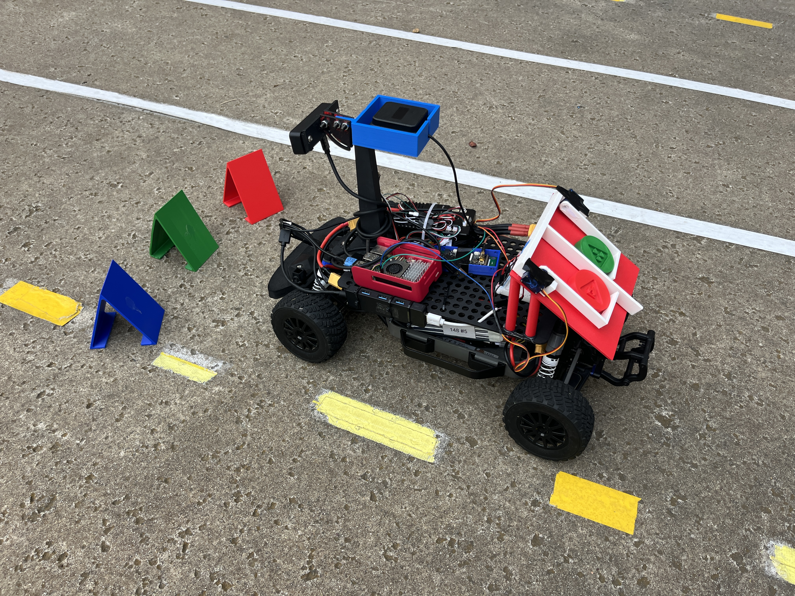

# UCSD ECE/MAE 148 Team 5 - Hazardous Location Reconnissance

<div align="center">

</div>
  
</body>

<div id="top"></div>

<h1 align="center">Hazardous Location Reconissance</h1>
<h4 align="center"></h4>
<!-- PROJECT LOGO -->
<div align="center">


<h3>ECE/MAE148 Final Project</h3>
<p>
Team 5 Spring 26
</p>



</div>


<!-- TABLE OF CONTENTS -->
<details>
  <summary>Table of Contents</summary>
  <ol>
    <li><a href="#team-members">Team Members</a></li>
    <li><a href="#final-project">Final Project</a></li>
      <ul>
        <li><a href="#original-goals">Original Goals</a></li>
          <ul>
            <li><a href="#goals-we-met">Goals We Met</a></li>
            <li><a href="#our-hopes-and-dreams">If We Have Another Week...</a></li>
              <ul>
                <li><a href="#stretch-goal-1">Stretch Goal 1</a></li>
                <li><a href="#stretch-goal-2">Stretch Goal 2</a></li>
              </ul>
         </ul>
       </ul>
    <li><a href="#final-project-documentation">Final Project Documentation</a></li>
    <ul>
      <li><a href="#CAD-Design">CAD Design </a></li>
      <ul>
            <li><a href="#modeled-ourselves">Modeled Ourselves</a></li>
            <li><a href="#open-source-parts">Open Source Parts</a></li>
          </ul>
        <li><a href="#Software">Software</a></li>
          <ul>
            <li><a href="#embedded-systems">Embedded Systems</a></li>
            <li><a href="#ros2">ROS2</a></li>
            <li><a href="#how-to-run">How to Run</a></li>
          </ul>
      </ul>
    <li><a href="#authors">Authors</a></li>
    <li><a href="#acknowledgments">Acknowledgments</a></li>
    <li><a href="#contact">Contact</a></li>
  </ol>
</details>


<!-- TEAM MEMBERS -->
## Team Members

<ul>
  <li>Josiah - Mechanical Engineering - '28</li>
  <li>Kim - Mechanical Engineering - '26</li>
  <li>Kathya -  Electrical Engineering - '27</li>
  <li>AnMei - Computer Engineering - '27</li>
</ul>

<!-- Final Project -->
## Final Project
<!-- put stuff here -->

<!-- Original Goals -->
### Original Goals
Our initial goals consisted of identifying and notifying individuals of a hazardous location through a physical marker. Following along a specified route, there would be four posibble inputs while running: Hazard 1 (Fire), Hazard 2 (Toxic Spill), False Hazard, and Home Base. While running the laps the car would use the OAK-D camera and a YOLO model to idenntify and report one of the inputs when spotted. For each hazard, the car would drop one of two markers depending on the hazard, for the false report the car will do nothing and note its identification, and upon finding all 3 other would return to the home base having completed its task. 
<!--example non visible text here -->
   
<!-- End Results -->
### Goals We Met
<p>
We succefully developed the car to navigate manually and complete the tasks. At the moment both the green and red hazards respond correctly to the servos and drop the corrected marker. This ultiimatley was the most important objective in our project and we succeeded. The car can succcesfully identify the various hazards and respond approppriatley to encountering them on its path. 


### If We Have Another Week...
#### Stretch Goal 1
Firstly, we would make the car complete the work  fully autonomously. While we succeded in practice, connecting to the servos and making them run upon detection of the correct hazard we had to manually drive. This deviated significantly from our original goals but became a neccecity due to time constraints. For this reason, if we had more time we would finish what we started and have the car be completing autonomous laps outside the JSOE building. 

#### Stretch Goal 2
Secondly, we would add the GPS componentnt to the car, linking live results to a website that stored gps locations of the hazard. To do so we would use the camera to also account for depth and the GPS to place a pin calculating the distance to the hazard. This would serve as an alert system for anyone with the website of an approaching hazard to their location. 

## Final Project Documentation

<!-- Early Quarter -->
### CAD Design
<!---->

#### Modeled Ourselves
| Part | CAD Model |
|------|--------|
| Hazards | <a href="assets/Hazards.stl"> Hazards.stl |
| Camera Mount | <a href="assets/Camera Mount.stl"> Camera Mount.stl |
| Payload Bay | <a href="PayloadBay.stl"> PayloadBay.stl |
| Mount | <a href="assets/Mount.stl"> Mount.stl |
| Green Marker | <a href="HazardMarkerGreen.stl"> HazardMarkerGreen.stl |
| Red Marker | <a href="HazardMarkerRed.stl"> HazardMarkerRed.stl |
| Chassis | <a href="ChassisFinal.stl"> ChassisFinal.stl |

#### Open Source Parts
| Part | CAD Model |
|------|--------|
| Camera | <a href="CameraCAD.stl"> Camera |

### Software
#### Component List
| Component | Purpose |
|---|---|
| Raspberry Pi 5 | Main onboard compute |
| OAK-D camera | Vision input for YOLO triangle detection |
| VESC motor controller | Drive motor + steering control, odometry |
| Servo 1 | Drops payload on hazard detection |
| Servo 2 | Drops payload on hazard detection |
| GPS module | Position logging, connected on `/dev/ttyACM0` |
| Logitech F710 joystick | Manual driving input |

#### ROS2
The autonomous stack is implemented as a ROS2 package, `hazard_recon_pkg`, containing the following nodes:

| Node | File | Role |
|---|---|---|
| `yolo_detection_node` | `yolo_detection_node.py` | Runs YOLO-based triangle detection (blue/green/red triangle classes) on the camera feed |
| `servo_payload_node` | `servo_payload_node.py` | Listens for hazard detections and triggers the payload-drop servo |
| `gps_logger_node` | `gps_logger_node.py` | Logs GPS position data throughout the run |

### How to Run
**Launch file:**

`hazardrecon.launch.py` brings up the full stack (`yolo_detection_node`, `servo_payload_node`, `gps_logger_node`) together.

---

# How to Run

### Prerequisites

This project runs inside the UCSD Robocar Docker image used for ECE/MAE 148:

```bash
docker pull ghcr.io/ucsd-ecemae-148/ucsd_robocar:stable
```

If the container hasn't been created yet, follow the class setup guide to create it. Guide can be found <a href= "https://ucsd-ecemae-148.github.io/Markdown-Instructions/index.html#s2">Here

### 1. Enter the Docker container

```bash
docker start robocar_team5
docker exec -it robocar_team5 bash
```

### 2. Set up a separate workspace for the custom package

Our `hazard_recon_pkg` lives in its own ROS2 workspace inside the container (separate from `ucsd_robocar_hub2`):

```bash
mkdir -p ~/hazard_ws/src
cd ~/hazard_ws/src
git clone https://github.com/UCSD-ECEMAE-148/148-spring-2026-final-project-team-5.git
cd ~/hazard_ws
colcon build --symlink-install
source install/setup.bash
```

### 3. Launch the autonomous stack

```bash
ros2 launch hazard_recon_pkg hazardrecon.launch.py
```

This brings up YOLO triangle detection, servo payload drop, and GPS logging together.

### 4. Manual driving (optional, host-side)

If ROS2 auto-laps not working, on the host machine (outside Docker), run:

```bash
python3 drive.py
```

This uses the F710 joystick for manual control.

Video Demo
<a href= "https://youtube.com/shorts/KrsDLd-abaA?feature=share">Here


<!-- Authors -->
## Authors

Josiah, Kim, Kathya, AnMei


<!-- ACKNOWLEDGMENTS -->
## Acknowledgments
Much appreciation to Professor Silberman and TAs Jose and Winston.

*This class be pretty cool. Fun fact: We had to change our idea various times but the final product is pretty cool.*


<!-- CONTACT -->
## Contact

* Josiah | jhallett@ucsd.edu
* Kim | insert here
* AnMei | adasbachprisk@ucsd.edu
* Kathya | kromanotepozteco@ucsd.edu
